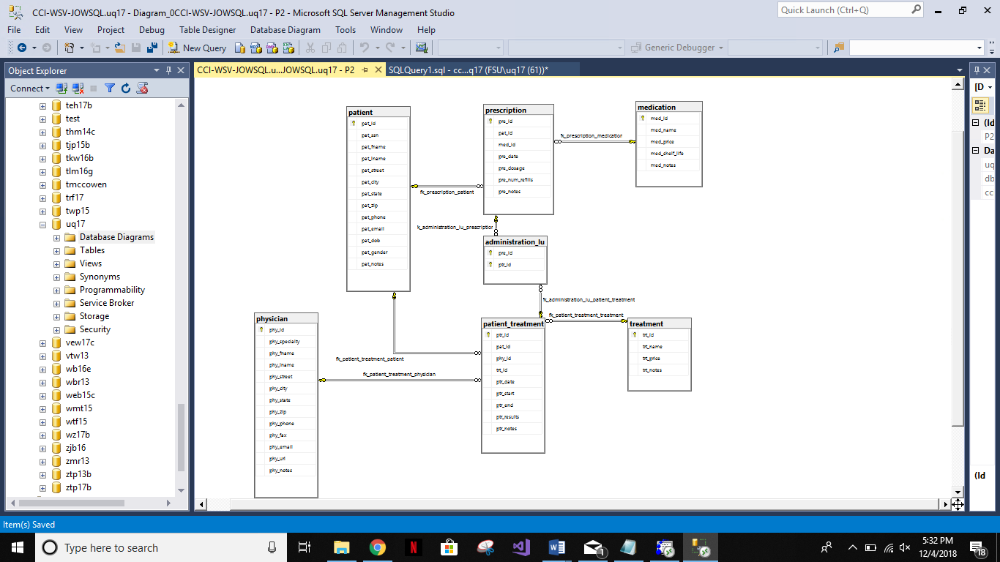
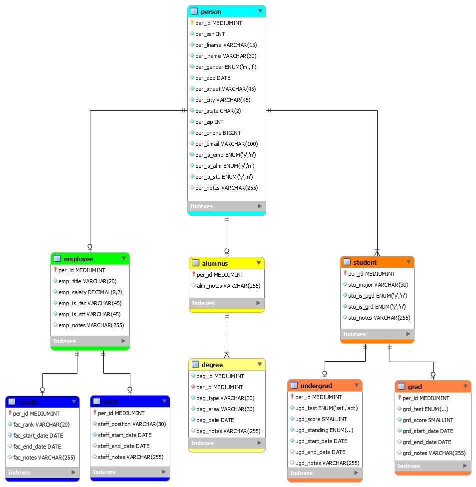

# Database-Design
This repository contains entity relationship diagrams of database models created using MySQL, SQL Workbench, and Microsoft SQL Server Management Studio. For each ERD, business rules of users were carefully analyzed to create entities and entity relationships. These data models are meant to reflect the responsibilities of a database administrator managing an IT enterprise. 

## Database Model for Patient-Physician Portal
This database model was developed for a theoretical patient-physician portal and implements the most efficient data types and entity relationships for this system. The ERD was developed using T-SQL and Microsoft SQL Server Management Studio and displays the various relationships between entities in the database. Download the SQL file here and view the ERD screenshot below.

## Database Model for University System
This entity relationship diagram displays the relationships between student, faculty, and staff for a potential university database. Necessary data types were closely researched before development for the most efficient data system. Download the data dictionary [here](a2.xlsx) and view the ERD screenshot below.

